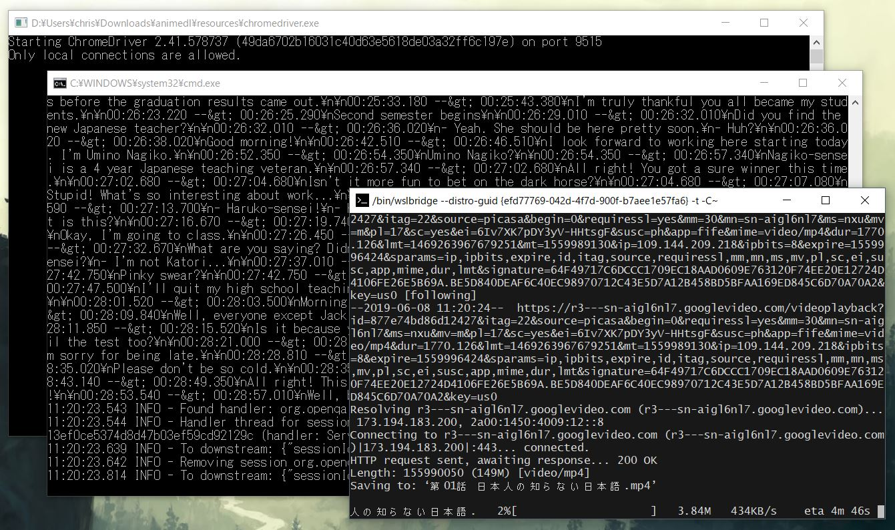

# Anime DL
Downloads Japanese media (anime, films, drama) from free sources with Japanese and English subtitles for use with [Voracious](https://github.com/rsimmons/voracious). Hence, this tool is only of any use for those studying Japanese.

**Note:** As I'm very busy studying Japanese any help adding support for additional sources or ticking off any of the [todo](#todo) items would be much appreciated!

## Requirements
- Windows Subsystem for Linux with PHP and [Composer](https://getcomposer.org/) installed.
- Java for Selenium
- Chrome

## Installation
Clone this repo to a suitable directory and ensure the defined composer dependencies are installed by running Composer's [install](https://getcomposer.org/doc/01-basic-usage.md#installing-dependencies) command.

## Usage
Open `resources/chromedriver.exe`, open `resources/start-selenium.bat`, open a CLI and run `php animedl.php [source-website.com]` for a listing of all available media or `php animedl.php [source-website.com] ["Media Name in Romaji"]` to download media with Japanese and English (if available) subtitles.

Run without any arguments to display all available sources:

     php animedl.php

Search a list of available media with grep:

     php animedl.php animejpnsub.ezyro.com | grep -i "nihonjin"
     
Download a title with English and Japanese subtitles ready for [Voracious](https://github.com/rsimmons/voracious):

    php animedl.php animejpnsub.ezyro.com "Nihonjin no Shiranai Nihongo"

## Sources
- animejpnsub.ezyro.com

## Todo
- Add more sources (e.g. daiweeb.org/terakoya, animelon.com, anjsub.com)
- Mac Support
- Linux Support
- Hide Chrome (prevent Chrome from popping up when downloading webpages)
- Rename project as 'anime-dl' doesn't really convey the project's intentions
